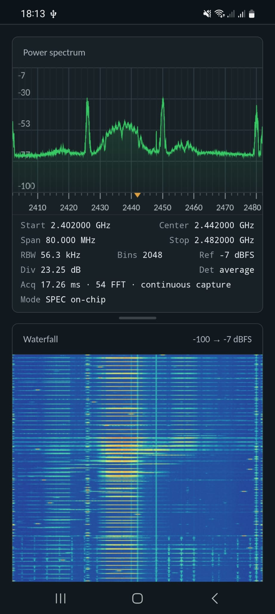

# ESP-WebSDR


Browser spectrum viewer and firmware installer for ESP32 chips, with live
FFT spectra, waterfalls, tuning, gain and bandwidth controls.

With the help of LLMs, we discovered an undocumented feature in Espressif's
ESP32 chips that bypasses the fixed-function modems to capture raw IQ baseband
samples. ESP-WebSDR pairs with the [ESP-SDR firmware](https://github.com/ESPARGOS/esp-sdr)
to display these samples as a live spectrum and waterfall in your browser,
turning supported ESP32 boards into low-cost software-defined radio receivers.


**Parts of this code are AI-generated.**
While we put a lot of manual effort into [pyespargos](https://github.com/ESPARGOS/pyespargos) and the firmware for our ESPARGOS One arrays, we don't have the time to manually review all of the source code for ESP-WebSDR.

## Get started

1. Use a browser with WebSerial or WebUSB support and connect your board over USB.
2. Install the matching firmware with the [firmware installer](https://espargos.net/espsdr/app/flash.html).
3. Open the [viewer](https://espargos.net/espsdr/app/), connect to the board, and select a frequency.

The installer and viewer default to **WebSerial on desktop** and **WebUSB on
mobile**, falling back to the available API when necessary. The installer's
Connect dropdown offers the other transport; the viewer's connection menu
lets you choose either one. Remembered viewer connections retain their
previously selected transport.

For WebUSB, use the chip's native USB connector: this backend supports
Espressif CDC interfaces, including USB Serial/JTAG. Use WebSerial for
external UART bridges.
Both APIs require HTTPS or localhost.

WebUSB still needs permission to claim the device's CDC interfaces. A desktop
OS driver may already own them; use WebSerial on such hosts. Browser/OS USB
restrictions cannot be bypassed by this backend. After a firmware change that
changes USB identity, select the device again (BOOT mode may be needed).
See [transport architecture and hardware checks](docs/usb-transport.md).

The installer also includes the **ESP32-S31 Ethernet / USB profile for
[SoapyESPSDR](https://github.com/ESPARGOS/SoapyESPSDR)**. Select that profile to
stream continuously to desktop SDR applications. It has its own receiver
control page at the board's DHCP address and does not use this serial viewer.

ESP32-C2 / ESP8684 boards are supported over UART, with up to 8,190 I/Q samples
and 256–2048-bin snapshot FFTs at 80/40/16 MS/s. The packaged C2 firmware requires
a 26 MHz crystal; the installer checks the crystal before writing. For CH340
bridges, use **Switch to 1 Mbaud** when the viewer reports transfer errors.
C2 analog bandwidth covers approximately 12–20 MHz; zero selects the open
capacitor setting. Controls are negotiated, so older C2 images retain their
80 MS/s-only capability and disabled bandwidth control.

Close other programs using the serial port. If automatic bootloader entry fails,
hold BOOT, tap RESET, then release BOOT and reconnect in the installer.

See the [ESP-SDR guide](https://espargos.net/espsdr/) for supported chips and setup.

## Desktop setup

Use Chrome, Edge, or [Firefox 151 or later](https://hacks.mozilla.org/2026/05/web-serial-support-in-firefox/)
on desktop. The installer and viewer use **WebSerial** by default, supporting
both native USB serial ports and external USB-to-UART bridges.

1. Connect your board with a USB data cable and close any serial monitor using
   its port.
2. Open the [firmware installer](https://espargos.net/espsdr/app/flash.html),
   click **Connect via WebSerial**, select the board's port, and install the
   matching ESP-SDR firmware if needed.
3. Open the [viewer](https://espargos.net/espsdr/app/), click **Connect ESP-SDR**,
   and select the port. Reception starts automatically. To explicitly select
   the desktop transport, use **Choose WebSerial Device…** in the connection menu.

On Windows or macOS, if an external USB-to-UART bridge does not appear as a
serial port, install its manufacturer's driver. Espressif's
[serial connection guide](https://docs.espressif.com/projects/esp-idf/en/release-v5.5/esp32h2/get-started/establish-serial-connection.html)
links to common bridge drivers and explains how to identify the port.

### Linux serial permissions

If the browser lists the port but cannot open it, check that your user has
read/write access. Native USB usually appears as `/dev/ttyACM0`; external
bridges often appear as `/dev/ttyUSB0`. Substitute your board's actual port:

```sh
ls -l /dev/ttyACM0
```

On Debian/Ubuntu, add your user to the serial-port group, then **log out and
back in** before reopening the browser:

```sh
sudo usermod -aG dialout "$USER"
```

Arch Linux normally uses `uucp` instead of `dialout`. Use the group shown for
your device; see the Linux permissions section in the Espressif guide above.

Alternatively, on a desktop using systemd-logind, a udev rule can grant the
active local user access to native Espressif serial ports. Create
`/etc/udev/rules.d/70-esp-web-sdr.rules` with this line:

```udev
SUBSYSTEM=="tty", ATTRS{idVendor}=="303a", TAG+="uaccess"
```

Reload the rules, then unplug and reconnect the board:

```sh
sudo udevadm control --reload-rules
```

This rule matches native Espressif USB devices, not CP210x, CH340 or FT232
bridges. For those, use the serial-port group method above. The rule grants
serial-port access for WebSerial; it does not release a CDC interface owned
by the Linux kernel for WebUSB. If WebUSB reports **Unable to claim interface**,
choose WebSerial. See [USB transport troubleshooting](docs/usb-transport.md#chromium-on-desktop-linux-unable-to-claim-interface).

## Chrome on Android

ESP-WebSDR also works directly in **Chrome on Android**: WebUSB connects the
browser to the ESP32, so no separate Android app is needed. The live spectrum,
waterfall, tuning, gain and bandwidth controls work in the mobile browser.

1. Connect a supported ESP32 board's **native USB connector** to an Android
   phone or tablet with USB host / OTG support, using a USB data cable and an
   OTG adapter if needed. External USB-to-UART bridges such as CP210x, CH340
   and FT232 are not supported by this WebUSB backend.
2. If the board does not already have ESP-SDR firmware, open the
   [firmware installer](https://espargos.net/espsdr/app/flash.html) in Chrome.
   Tap **Connect via WebUSB**, select the board and grant USB access, then
   install the matching ESP-SDR firmware. If bootloader entry fails, hold
   BOOT, tap RESET, release BOOT and connect again.
3. Open the [viewer](https://espargos.net/espsdr/app/) in Chrome and tap
   **Connect ESP-SDR**. Select the board and grant access when prompted;
   WebUSB is selected automatically on mobile. You can also explicitly select
   **Choose WebUSB Device…** from the connection menu.
4. Once connected, reception starts automatically. Select a frequency and
   adjust the controls to explore the spectrum and waterfall.

If flashing changes the board's USB identity, select it again in the viewer.
Use the HTTPS links above: an HTTP page served from another computer on your
local network does not provide the secure context required by WebUSB.



## Contributors

<table>
  <tr>
    <td align="center">
      <a href="https://github.com/Jeija">
        <br>
        <b>Florian Euchner</b>
      </a>
    </td>
    <td align="center">
      <a href="https://github.com/zodoczi">
        <br>
        <b>Zoltan Doczi</b>
      </a>
    </td>
  </tr>
</table>

## License

Except where otherwise noted, ESP-WebSDR is free software: you may redistribute
it and/or modify it under the GNU General Public License as published by the
Free Software Foundation, either version 3 of the License, or (at your option)
any later version (`GPL-3.0-or-later`). See [LICENSE](LICENSE) for the full terms.
It is provided without any warranty, including implied warranties of
merchantability or fitness for a particular purpose.

Third-party components retain their own licenses and copyright notices.
Bundled dependency licenses are in `flasher/vendor/`; the font license is in
`fonts.css`. The accompanying [ESP-SDR firmware](https://github.com/ESPARGOS/esp-sdr)
is licensed separately; see its license and third-party notices.

ESP32-H2 uses its Bluetooth PHY capture engine at 32, 16, approximately
10.667, and 6.4 MS/s (rate codes 7, 6, 8, and 9),
with up to 16,380 complex samples and 256–2048-bin snapshot spectra. Both
native USB Serial/JTAG and UART0 (TX GPIO24, RX GPIO23) are supported.
The installer includes an H2 image for 2 MB or larger flash. The analog bandwidth control covers approximately 4–11 MHz; zero selects
the widest filter setting. Lower rates are hardware subsampling without
automatic anti-alias filtering. Continuous capture is not advertised. On a TX/RX-only adapter,
enter download mode with BOOT/RESET before installation and reset afterward;
the adapter cannot control the board's reset pins.
