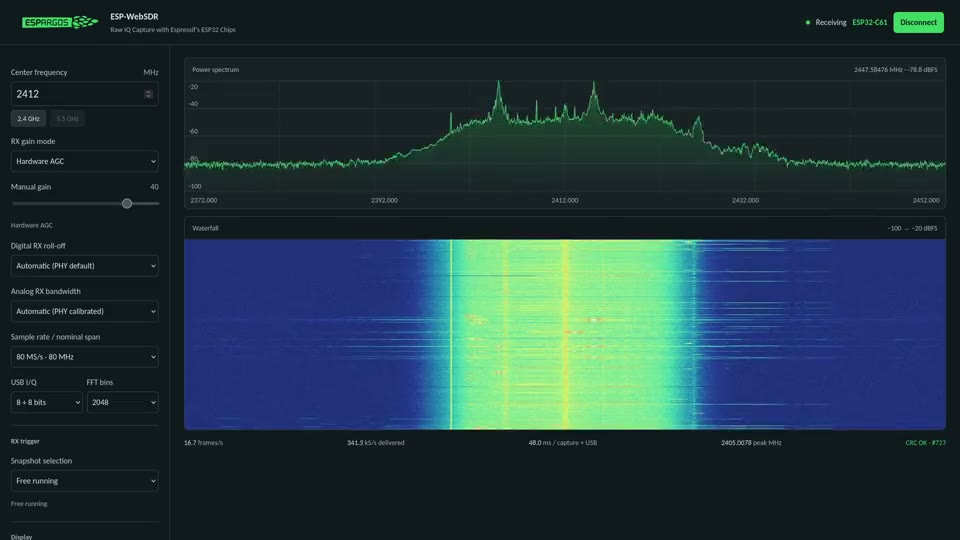

# ESP-WebSDR

Browser spectrum viewer and firmware installer for ESP32, ESP32-C5, C6, C61,
S2, S3 and S31. View live FFT spectra and waterfalls, tune the receiver, and
adjust gain, bandwidth and sample precision.

## Get started

1. Use a browser with Web Serial support and connect your board over USB.
2. Install the matching firmware with the [firmware installer](flash.html).
3. Open the [viewer](index.html), connect to the board, and select a frequency.

Close other programs using the serial port. If automatic bootloader entry fails,
hold BOOT, tap RESET, then release BOOT and reconnect in the installer.

Native USB is supported on C5/C6/C61/S2/S3/S31. The original ESP32 requires
a USB-to-UART adapter; C6/C61/S2/S3/S31 also support UART at **2,000,000 baud,
8N1, no flow control**. See the [firmware README](../esp-sdr/README.md) for wiring,
flash requirements and chip limits. S2 UART support remains untested on hardware.

## Receive controls

Available controls follow the firmware's capabilities. Hardware AGC is the
default; manual gain selects a PHY table index, not an absolute gain in dB.
The viewer starts at 80 MS/s and 20 MHz bandwidth when supported, with short
trace averaging. Analog bandwidth is approximate; “Wide open” selects the
widest filter setting.

Captures have gaps. Sample rate describes each snapshot, not sustained USB/UART
throughput. Power is uncalibrated dBFS, and browser receive times are not hardware
timestamps. Extended tuning may show a warning: PLL lock and reception outside
standard Wi-Fi centers are not guaranteed. Only one client can control the
radio at a time; disconnect or allow five seconds of idle time before switching.

## Development

Run checks with `node --test tests/*.test.mjs`.
Bundled dependency licenses are in `flasher/vendor/`; the font license is in
`fonts.css`. The screenshot comes from the ESPARGOS project documentation.
